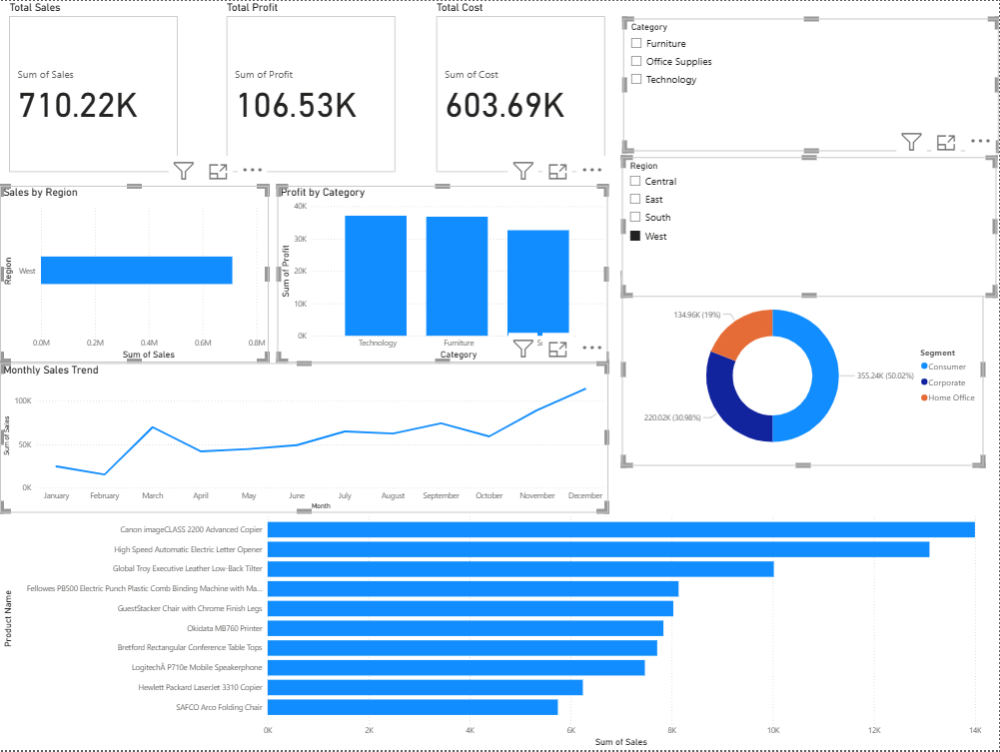

# Sales and Profit Analysis Dashboard

## Project Overview

This project analyzes retail sales data using Power BI. The dashboard provides insights into sales performance, profit distribution, customer segments, product categories, and regional sales trends. Interactive visualizations help identify business opportunities and support data-driven decision-making.

## Tools Used

- Power BI
- Microsoft Excel

## Dataset Information

The dataset contains retail sales transaction data, including:

- Order Date
- Region
- Category
- Segment
- Product Name
- Sales
- Profit
- Cost

Note:
Profit and Cost columns were derived using a fixed profit margin assumption for analysis purposes.

## Dashboard Features

### KPI Cards
- Total Sales
- Total Profit
- Total Cost

### Visualizations
- Sales by Region
- Profit by Category
- Monthly Sales Trend
- Sales by Segment
- Top 10 Products by Sales

### Filters
- Region Slicer
- Category Slicer

## Key Insights

- West region generated the highest sales revenue.
- Technology category contributed the highest profit.
- Consumer segment accounted for the largest share of sales.
- Monthly sales trends showed fluctuations across different periods.
- Top-performing products contributed significantly to overall revenue.

## Project Files

- Sales_Profit_Data.xlsx
- Sales_Profit_Dashboard.pbix
- Dashboard_Screenshot.png

## Dashboard Preview

## Conclusion

The dashboard provides a clear view of sales performance and profitability across different business dimensions. It enables users to explore data interactively and identify important trends, high-performing categories, and customer segments.
